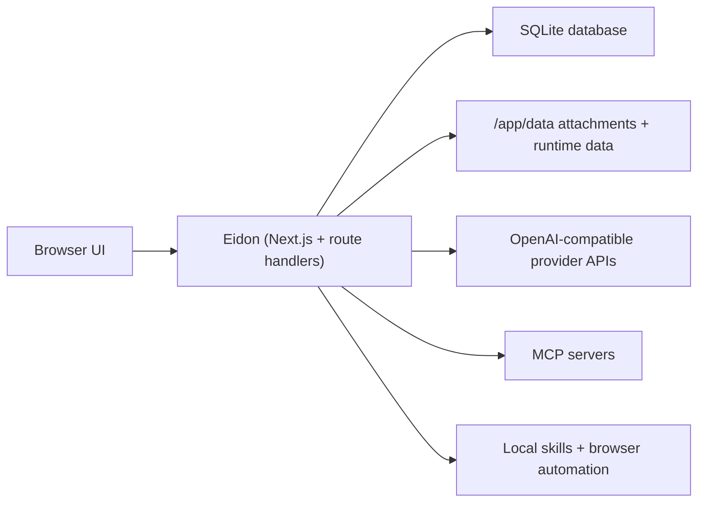

<div align="center">

# Eidon

<p>
  <strong>A self-hosted conversational workspace with streaming, visible reasoning, reusable skills, MCP integrations, and long-memory compaction.</strong>
</p>

<p>
  <a href="#what-is-eidon">What is Eidon?</a>
  ·
  <a href="#feature-snapshot">Feature Snapshot</a>
  ·
  <a href="#local-development">Local Development</a>
  ·
  <a href="#production-with-docker">Production with Docker</a>
  ·
  <a href="#configuration">Configuration</a>
  ·
  <a href="#security-notes">Security Notes</a>
</p>

<p>
  
  
  
  
  
</p>

</div>

Eidon is a private, self-hosted chat application for people who want a clean ChatGPT-style interface on infrastructure they control. It is designed as a single-user workspace: you bring your own provider API key, configure tools and skills, and keep conversations, settings, and credentials on your own machine or server.

It combines a polished conversational UI with production-minded primitives: streaming responses, provider profiles, local auth, MCP servers, reusable skills, configurable retention, and context compaction that keeps long threads usable without throwing away important state.

## What is Eidon?

Eidon gives you a local-first assistant workspace with:

- Streaming chat with support for visible reasoning and tool call timelines
- OpenAI-compatible provider profiles, including custom API base URLs
- GitHub Copilot provider — chat through your own Copilot subscription via OAuth
- Long-memory compaction to preserve context in lengthy conversations
- MCP server support for external tools and services
- Reusable skills, including a built-in browser automation skill in the Docker image
- Single-user local authentication with a settings UI for account management
- SQLite-backed persistence for chats, settings, sessions, skills, and memory nodes

Eidon is not a multi-tenant SaaS control plane. It is closer to a private operator console for your own assistant workflow.

## Feature Snapshot

| Capability | What it means in practice |
| --- | --- |
| Streaming responses | Assistant output streams into the UI as it is generated |
| Long-memory compaction | Older messages are compacted into structured memory nodes so long threads remain useful |
| Provider profiles | Save multiple model/API configurations and switch conversation behavior cleanly |
| MCP servers | Connect tools over streamable HTTP or `stdio` transports |
| Skills | Save reusable `SKILL.md` instructions and enable them globally |
| Local auth | Password login with server-backed sessions and an in-app account screen |
| Local persistence | Data lives in SQLite plus a writable data directory you can back up or mount |

## Architecture



## Local Development

### Prerequisites

- Node.js 22+
- npm
- A local toolchain capable of building `better-sqlite3`

### 1. Install dependencies

```bash
npm install
```

### 2. Create a local env file

Create `.env` in the repo root:

```bash
EIDON_PASSWORD_LOGIN_ENABLED=false
EIDON_ADMIN_USERNAME=admin
EIDON_ADMIN_PASSWORD=dev-password-change-me
EIDON_SESSION_SECRET=dev-session-secret-change-me-with-32-plus-chars
EIDON_ENCRYPTION_SECRET=dev-encryption-secret-change-me-with-32-plus-chars
```

Notes:

- `EIDON_PASSWORD_LOGIN_ENABLED=false` is the simplest development mode. Eidon boots the admin user directly and bypasses the login screen.
- If you want to test the password login flow locally, set `EIDON_PASSWORD_LOGIN_ENABLED=true`.
- In non-production environments, Eidon can fall back to development defaults for the admin password and secrets, but explicitly setting them is cleaner and closer to real deployments.

### 3. Start the app

```bash
npm run dev
```

Open [http://localhost:3000](http://localhost:3000).

`npm run dev` starts Eidon through the custom websocket server, which is required for the `/ws` realtime chat transport. `npm run dev:next` is available if you explicitly want plain Next.js without the websocket chat runtime.

### 4. Configure your model provider

After the app is running:

1. Open **Settings**
2. Go to **Providers**
3. Add your API key and model configuration
4. Start a new chat

Eidon does not ship with a provider API key.

### Useful development commands

| Command | Purpose |
| --- | --- |
| `npm run dev` | Start the Eidon dev server with websocket chat support |
| `npm run dev:next` | Start plain Next.js without the websocket chat server |
| `npm run lint` | Run ESLint |
| `npm run typecheck` | Run TypeScript checks |
| `npm run test` | Run unit tests with coverage |
| `npm run test:e2e` | Run Playwright smoke and feature tests |

## Production With Docker

The repository includes a production Dockerfile. The image runs Eidon as a non-root user, stores runtime data under `/app/data`, and enables password login by default.

### Production requirements

You must provide all of the following at runtime:

- `EIDON_ADMIN_USERNAME`
- `EIDON_ADMIN_PASSWORD`
- `EIDON_SESSION_SECRET`
- `EIDON_ENCRYPTION_SECRET`

Production startup fails fast if:

- `EIDON_ADMIN_PASSWORD` is missing
- `EIDON_SESSION_SECRET` is missing
- `EIDON_ENCRYPTION_SECRET` is missing
- Any of those values are still set to a published placeholder/default value

Generate the two secrets on macOS or Linux with:

```bash
openssl rand -hex 32
openssl rand -hex 32
```

Or export them directly in your shell:

```bash
export EIDON_SESSION_SECRET="$(openssl rand -hex 32)"
export EIDON_ENCRYPTION_SECRET="$(openssl rand -hex 32)"
```

### Build the image

```bash
docker build -t eidon:latest .
```

### Run with `docker run`

```bash
docker run -d \
  --name eidon \
  --restart unless-stopped \
  -p 3000:3000 \
  -v eidon-data:/app/data \
  -e EIDON_PASSWORD_LOGIN_ENABLED=true \
  -e EIDON_ADMIN_USERNAME=admin \
  -e EIDON_ADMIN_PASSWORD='replace-this-with-a-long-random-password' \
  -e EIDON_SESSION_SECRET='replace-this-with-a-long-random-session-secret' \
  -e EIDON_ENCRYPTION_SECRET='replace-this-with-a-long-random-encryption-secret' \
  -e EIDON_GITHUB_APP_CLIENT_ID='Iv1.xxxxxxxx' \
  -e EIDON_GITHUB_APP_CLIENT_SECRET='xxxxxxxxxxxxxxxxxxxxxxxxxxxxxxxxxxxxxxxx' \
  -e EIDON_GITHUB_APP_CALLBACK_URL='https://your-host/api/providers/github/callback' \
  eidon:latest
```

Then put Eidon behind HTTPS with your reverse proxy of choice.

### Run with Docker Compose

```yaml
services:
  eidon:
    build: .
    image: eidon:latest
    restart: unless-stopped
    ports:
      - "3000:3000"
    environment:
      EIDON_PASSWORD_LOGIN_ENABLED: "true"
      EIDON_ADMIN_USERNAME: "admin"
      EIDON_ADMIN_PASSWORD: "replace-this-with-a-long-random-password"
      EIDON_SESSION_SECRET: "replace-this-with-a-long-random-session-secret"
      EIDON_ENCRYPTION_SECRET: "replace-this-with-a-long-random-encryption-secret"
      EIDON_GITHUB_APP_CLIENT_ID: "Iv1.xxxxxxxx"
      EIDON_GITHUB_APP_CLIENT_SECRET: "xxxxxxxxxxxxxxxxxxxxxxxxxxxxxxxxxxxxxxxx"
      EIDON_GITHUB_APP_CALLBACK_URL: "https://your-host/api/providers/github/callback"
    volumes:
      - eidon-data:/app/data

volumes:
  eidon-data:
```

Start it with:

```bash
docker compose up -d --build
```

### First production login

1. Visit your Eidon URL
2. Sign in with `EIDON_ADMIN_USERNAME` and `EIDON_ADMIN_PASSWORD`
3. Open **Settings → Account**
4. Rotate the username/password if needed
5. Open **Settings → Providers** and set your provider API key

## GitHub Copilot Provider

Eidon can route chat through your GitHub Copilot subscription instead of a direct API key. This requires registering a GitHub App so Eidon can perform the OAuth flow on your behalf.

### Create the GitHub App

1. Go to **[github.com/settings/developers](https://github.com/settings/developers)** and click **New GitHub App**
2. Fill in the form:
   - **GitHub App name** — anything you like (e.g. `Eidon Dev`)
   - **Homepage URL** — your Eidon instance URL
   - **Callback URL** — `http://localhost:3000/api/providers/github/callback` for local dev, or `https://<your-host>/api/providers/github/callback` in production
   - Under **Identifying and authorizing users**, check **Request user authorization (OAuth) during installation**
   - **Where can this GitHub App be installed?** — choose *Only on this account*
3. Click **Create GitHub App**
4. On the app's general settings page, copy the **Client ID** — this is `EIDON_GITHUB_APP_CLIENT_ID`
5. Click **Generate a new client secret** and copy it — this is `EIDON_GITHUB_APP_CLIENT_SECRET`
6. The callback URL you set in step 2 is `EIDON_GITHUB_APP_CALLBACK_URL`

### Configure the environment

Add the three variables to `.env` (dev) or your container environment (production):

```bash
EIDON_GITHUB_APP_CLIENT_ID=Iv1.xxxxxxxx
EIDON_GITHUB_APP_CLIENT_SECRET=xxxxxxxxxxxxxxxxxxxxxxxxxxxxxxxxxxxxxxxx
EIDON_GITHUB_APP_CALLBACK_URL=http://localhost:3000/api/providers/github/callback
```

All three are optional — if they are not set, the GitHub Copilot provider type is still visible in settings but the connection flow is disabled.

### Connect a profile

1. Open **Settings → Providers**
2. Create a new profile (or edit an existing one) and set **Provider type** to *GitHub Copilot*
3. Click **Connect GitHub** — you will be redirected to GitHub to authorize
4. After approving, you'll be returned to settings and the profile will show your GitHub username
5. Pick a model from the dropdown and start chatting

## Configuration

| Variable | Purpose | Required in production |
| --- | --- | --- |
| `EIDON_PASSWORD_LOGIN_ENABLED` | Enables password-based login | No, but `true` is the normal production mode |
| `EIDON_ADMIN_USERNAME` | Initial admin username | Yes |
| `EIDON_ADMIN_PASSWORD` | Initial admin password | Yes |
| `EIDON_SESSION_SECRET` | Session signing secret | Yes |
| `EIDON_ENCRYPTION_SECRET` | Encryption seed for stored provider credentials | Yes |
| `EIDON_DATA_DIR` | Directory for SQLite and runtime data | No |
| `EIDON_GITHUB_APP_CLIENT_ID` | GitHub App OAuth client ID for the Copilot provider | No |
| `EIDON_GITHUB_APP_CLIENT_SECRET` | GitHub App OAuth client secret for the Copilot provider | No |
| `EIDON_GITHUB_APP_CALLBACK_URL` | GitHub App OAuth callback URL (must match the app settings on GitHub) | No |

Runtime defaults:

- Default model: `gpt-5-mini`
- Default API mode: `responses`
- Default storage path in the Docker image: `/app/data`

## Security Notes

Eidon is single-user, but that user is highly privileged inside the app.

- Always terminate TLS before exposing Eidon to the internet
- Rate-limit `POST /api/auth/login` at the reverse proxy
- Use long, random values for the admin password and both secrets
- Persist `/app/data` on a named volume or host mount
- Treat configured MCP servers and shell-capable skills as trusted/admin-level features
- Rotate provider API keys and bootstrap secrets during redeploys when needed

If you are deploying Eidon on a public VPS, the minimum baseline should be:

- HTTPS
- Strong secrets
- A persistent data volume
- Login rate limiting
- A reverse proxy such as Caddy, Nginx, or Traefik

## Project Stack

- Next.js App Router
- React 19
- TypeScript
- SQLite via `better-sqlite3`
- `argon2` for password hashing
- `jose` for signed session cookies
- `zod` for validation
