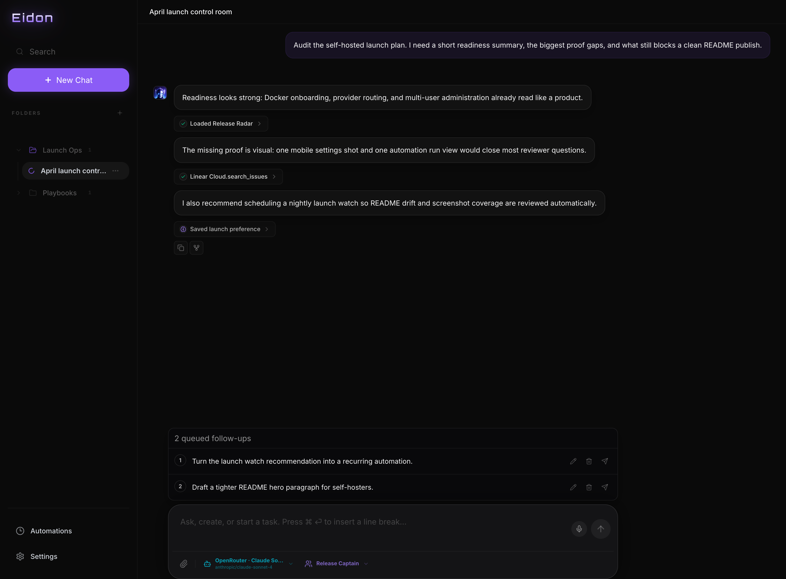
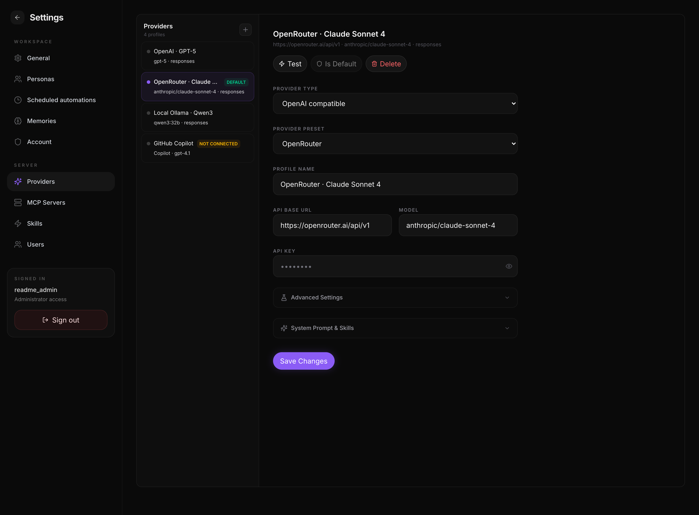
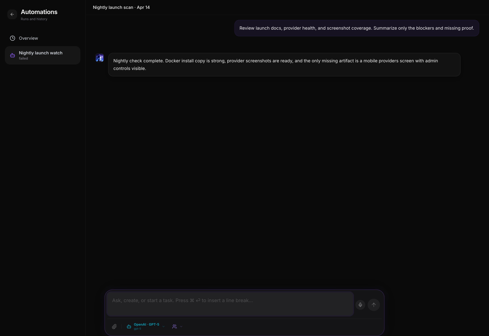
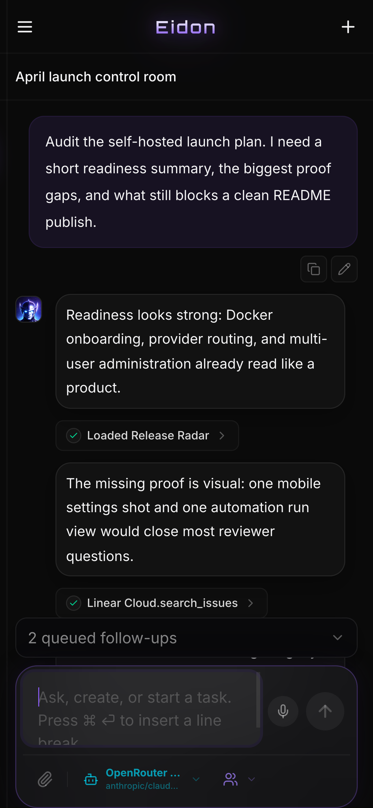
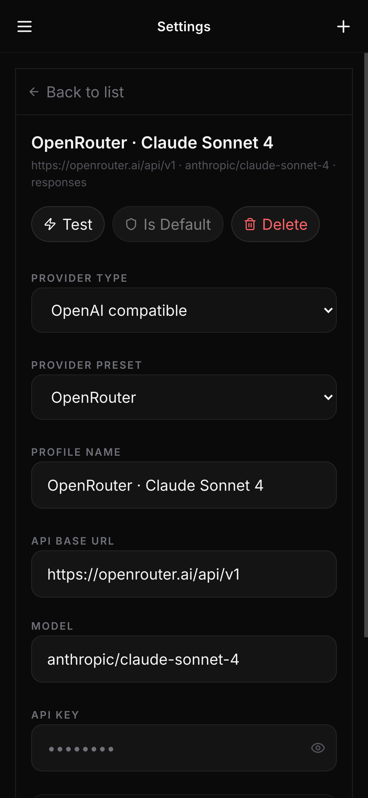

<div align="center">
  
  <br />
  

  <p>
    <strong>Eidon is a self-hosted, single-container, bring-your-own-provider AI assistant for anyone who wants something in the shape of ChatGPT, Gemini, or Claude, but on infrastructure they control.</strong>
  </p>

  <p>
    <a href="#what-is-eidon">What is Eidon?</a>
    ·
    <a href="#feature-highlights">Features</a>
    ·
    <a href="#supported-providers">Providers</a>
    ·
    <a href="#screenshots">Screenshots</a>
    ·
    <a href="#quick-start">Quick Start</a>
    ·
    <a href="#github-copilot-provider">GitHub Copilot</a>
    ·
    <a href="#configuration-essentials">Configuration</a>
    ·
    <a href="#local-development">Local Development</a>
    ·
    <a href="#security--storage-notes">Security</a>
  </p>

  <p>
    
    
    
    
    
  </p>
</div>

## What is Eidon?

Eidon is an all-in-one assistant workspace you can self-host with a single Docker container. You bring your own model provider, keep your own data, and get a polished chat experience with memory, tools, automations, web search, and multi-user administration in one place.

It is designed to feel approachable on day one, whether you want a private assistant for personal use, day-to-day work, or a shared workspace for a group. Instead of stitching together a chat UI, auth, model routing, memory, browser tooling, and scheduling yourself, Eidon ships the whole workspace and lets you plug in the providers and tools you trust.

## Feature Highlights

- Single Docker deployment with SQLite-backed persistence under `/app/data`
- Multi-user workspace with `admin` and `user` roles
- Bring-your-own-provider model routing instead of a locked-in hosted backend
- Multiple provider profiles per workspace, including OpenAI-compatible endpoints and GitHub Copilot
- Automatic memory system with conversation compaction for long-running threads
- Chat forking from assistant replies when you want to branch a thread without losing context
- Previous message editing with restart-from-edit flow for fast iteration
- Personas you can switch in the composer to change assistant behavior per task
- Reusable skills stored in-app and available across chats
- MCP server support over `streamable_http` and `stdio`
- Docker image already includes both `uvx` and `npx` for `stdio` MCP workflows
- Built-in web search with Exa, Tavily, or SearXNG
- Built-in browser automation via the bundled `agent-browser` skill
- Scheduled automations with run history and transcript views
- Streaming chat with visible action timelines
- Browser speech-to-text in the chat composer
- Image generation support
- Full mobile PWA support for chat and admin flows
- Multiple clients stay in sync live through the websocket runtime

## Supported Providers

Eidon currently supports these provider options:

- OpenAI-compatible endpoints, including OpenAI and other compatible APIs
- OpenRouter
- Ollama Cloud
- GLM Coding Plan
- GitHub Copilot

The OpenAI-compatible profile is manually configurable, so any service that exposes an OpenAI-compatible API can be connected through the same provider type.

## Screenshots



<p align="center">
  <em>Desktop chat workspace with provider switching, persona selection, queued follow-ups, and visible tool activity.</em>
</p>

| Desktop providers | Automation transcript |
| --- | --- |
|  |  |
| <sub>Multiple saved providers, presets, and admin settings in one workspace.</sub> | <sub>Scheduled automation output captured as a normal transcript you can review like any other chat.</sub> |

| Mobile chat | Mobile providers |
| --- | --- |
|  |  |
| <sub>Chat, queued work, and provider context on a phone-sized layout.</sub> | <sub>Provider administration still works cleanly on mobile.</sub> |

## Quick Start

### 1. Build the image

```bash
docker build -t eidon:latest .
```

### 2. Generate strong secrets on the host

```bash
export EIDON_ADMIN_PASSWORD="$(openssl rand -base64 24)"
export EIDON_SESSION_SECRET="$(openssl rand -hex 32)"
export EIDON_ENCRYPTION_SECRET="$(openssl rand -hex 32)"
```

### 3. Run Eidon with `docker run`

```bash
docker run -d \
  --name eidon \
  --restart unless-stopped \
  -p 3000:3000 \
  -v eidon-data:/app/data \
  -e EIDON_PASSWORD_LOGIN_ENABLED=true \
  -e EIDON_ADMIN_USERNAME=admin \
  -e EIDON_ADMIN_PASSWORD="$EIDON_ADMIN_PASSWORD" \
  -e EIDON_SESSION_SECRET="$EIDON_SESSION_SECRET" \
  -e EIDON_ENCRYPTION_SECRET="$EIDON_ENCRYPTION_SECRET" \
  eidon:latest
```

### 4. Or run it with Docker Compose

```yaml
services:
  eidon:
    build: .
    image: eidon:latest
    restart: unless-stopped
    ports:
      - "3000:3000"
    environment:
      EIDON_PASSWORD_LOGIN_ENABLED: "true"
      EIDON_ADMIN_USERNAME: "admin"
      EIDON_ADMIN_PASSWORD: "${EIDON_ADMIN_PASSWORD}"
      EIDON_SESSION_SECRET: "${EIDON_SESSION_SECRET}"
      EIDON_ENCRYPTION_SECRET: "${EIDON_ENCRYPTION_SECRET}"
    volumes:
      - eidon-data:/app/data

volumes:
  eidon-data:
```

Start it with the exported variables above, or put the same values in a local `.env` file before launching:

```bash
docker compose up -d --build
```

### 5. First login

1. Open your Eidon URL.
2. Sign in with `EIDON_ADMIN_USERNAME` and `EIDON_ADMIN_PASSWORD`.
3. Go to **Settings → Providers**.
4. Add your provider API key or connect GitHub Copilot.
5. Start chatting.

Eidon does not ship with a provider API key. The deployment is ready first; you bring the model access you want to use.

## Why the Docker Image Is Different

The production image is meant to be useful on its own, not just a way to serve the UI.

- It runs as a non-root user
- Runtime data lives under `/app/data`
- Password login is supported out of the box
- The browser automation skill is bundled
- `uvx`, `npx`, and Chromium are available for MCP and browser-backed workflows

## GitHub Copilot Provider

Eidon can route chats through your GitHub Copilot subscription instead of a direct provider API key. To enable the OAuth flow, register a GitHub App and set:

```bash
EIDON_GITHUB_APP_CLIENT_ID=Iv1.xxxxxxxx
EIDON_GITHUB_APP_CLIENT_SECRET=xxxxxxxxxxxxxxxxxxxxxxxxxxxxxxxxxxxxxxxx
EIDON_GITHUB_APP_CALLBACK_URL=https://your-host/api/providers/github/callback
```

### Create the GitHub App

1. Go to [github.com/settings/developers](https://github.com/settings/developers) and create a new GitHub App.
2. Use your Eidon URL as the homepage.
3. Set the callback URL to `https://<your-host>/api/providers/github/callback`.
4. Under user authorization, enable OAuth during installation.
5. Copy the Client ID and generate a Client Secret.

### Connect a Copilot profile

1. Open **Settings → Providers**.
2. Add a profile and switch **Provider type** to **GitHub Copilot**.
3. Click **Connect GitHub**.
4. Approve the authorization flow.
5. Pick a model and start chatting.

If those three environment variables are not set, the GitHub Copilot profile type is still visible in settings, but the OAuth connection flow will not work. Set all three values before using **Connect GitHub**.

## Configuration Essentials

| Variable | Purpose | Required in production |
| --- | --- | --- |
| `EIDON_PASSWORD_LOGIN_ENABLED` | Enables password-based login | No, but `true` is the normal production mode |
| `EIDON_ADMIN_USERNAME` | Initial admin username | Yes |
| `EIDON_ADMIN_PASSWORD` | Initial admin password | Yes |
| `EIDON_SESSION_SECRET` | Session signing secret | Yes |
| `EIDON_ENCRYPTION_SECRET` | Encryption seed for stored provider credentials | Yes |
| `EIDON_DATA_DIR` | Directory for SQLite and runtime data | No |
| `EIDON_GITHUB_APP_CLIENT_ID` | GitHub App client ID for the Copilot provider | No |
| `EIDON_GITHUB_APP_CLIENT_SECRET` | GitHub App client secret for the Copilot provider | No |
| `EIDON_GITHUB_APP_CALLBACK_URL` | OAuth callback URL for Copilot | No |

Useful defaults:

- Default model: `gpt-5-mini`
- Default API mode: `responses`
- Default Docker data path: `/app/data`

Generate secrets on macOS or Linux with:

```bash
openssl rand -hex 32
openssl rand -hex 32
```

## Local Development

### Prerequisites

- Node.js 22+
- npm
- A local toolchain capable of building `better-sqlite3`

### Install and start

```bash
npm install
```

Create a local `.env`:

```bash
EIDON_PASSWORD_LOGIN_ENABLED=false
EIDON_ADMIN_USERNAME=admin
EIDON_ADMIN_PASSWORD=dev-password-change-me
EIDON_SESSION_SECRET=dev-session-secret-change-me-with-32-plus-chars
EIDON_ENCRYPTION_SECRET=dev-encryption-secret-change-me-with-32-plus-chars
```

Run the app:

```bash
npm run dev
```

Open [http://localhost:3000](http://localhost:3000).

`npm run dev` uses the custom websocket server, which is required for the realtime chat runtime. `npm run dev:next` is available when you explicitly want plain Next.js without that websocket layer.

### Useful commands

| Command | Purpose |
| --- | --- |
| `npm run dev` | Start the websocket-enabled dev server |
| `npm run dev:next` | Start plain Next.js without the websocket runtime |
| `npm run lint` | Run ESLint |
| `npm run typecheck` | Run TypeScript checks |
| `npm run test` | Run unit tests with coverage |
| `npm run test:e2e` | Run Playwright smoke and feature tests |
| `npm run seed:readme-demo` | Create the disposable README screenshot dataset under `.context/readme-demo-data` |

## Security & Storage Notes

Eidon is powerful by design, so treat it like an admin-grade internal tool.

- Always terminate TLS before exposing Eidon publicly.
- Rate-limit `POST /api/auth/login` at your reverse proxy.
- Use long, random values for the admin password and both secrets.
- Persist `/app/data` on a named volume or host mount.
- Treat MCP servers, browser automation, and shell-capable skills as trusted features.
- Rotate provider keys and bootstrap secrets during redeploys when needed.

For a public VPS deployment, the minimum baseline should be:

- HTTPS
- strong secrets
- a persistent data volume
- login rate limiting
- a reverse proxy such as Caddy, Nginx, or Traefik

## License

Eidon is licensed under the GNU Affero General Public License v3.0 (`AGPL-3.0-only`). See [LICENSE](./LICENSE).

## Stack

- Next.js App Router
- React 19
- TypeScript
- SQLite via `better-sqlite3`
- `argon2` for password hashing
- `jose` for signed session cookies
- `zod` for validation
