<a name="readme-top"></a>

<div align="center">
  
  <br />
  

  <p>
    <strong>Self-hosted AI chat, with agents and automations.</strong><br />
    One Docker image. Your own model keys. Your data stays on your server.
  </p>

  <p>
    <a href="#quick-start"><b>Quick start</b></a>
    ·
    <a href="#chat"><b>Features</b></a>
    ·
    <a href="#providers"><b>Providers</b></a>
    ·
    <a href="./docs/configuration.md"><b>Configuration</b></a>
    ·
    <a href="#documentation"><b>Docs</b></a>
  </p>

  <p>
    <a href="https://github.com/Quack6765/Eidon-AI/actions/workflows/test.yml"></a>
    <a href="https://github.com/Quack6765/Eidon-AI/releases"></a>
    <a href="https://github.com/Quack6765/Eidon-AI/pkgs/container/eidon-ai"></a>
    <a href="./LICENSE"></a>
    
  </p>

  <table>
    <tr>
      <td width="33%" align="center">
        <a href="./.github/readme/desktop-chat.png"></a>
        <br /><b>Chat</b>
      </td>
      <td width="33%" align="center">
        <a href="./.github/readme/desktop-delegation.png">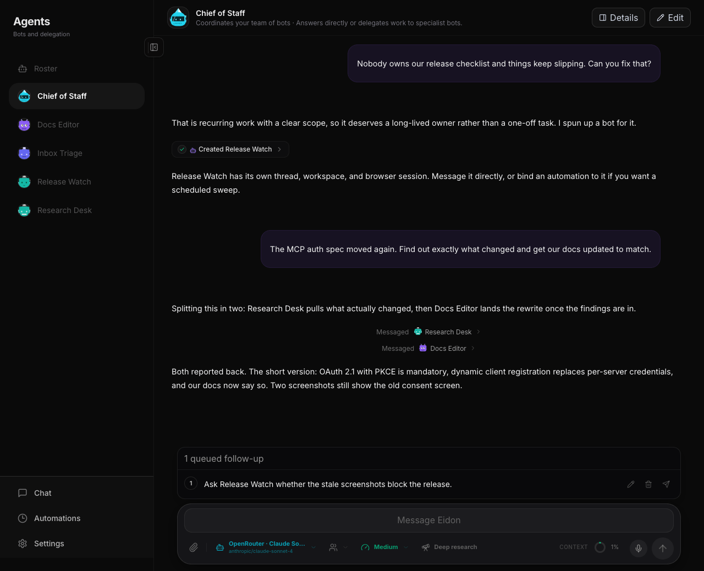</a>
        <br /><b>Agents</b>
      </td>
      <td width="33%" align="center">
        <a href="./.github/readme/desktop-automations.png"></a>
        <br /><b>Automations</b>
      </td>
    </tr>
  </table>

  <sub>Click any screenshot to see it full size.</sub>
</div>

Eidon is a self-hosted AI assistant. It runs as one Docker image, keeps your data in a
single file on your server, and works with the model providers you already use.

Get your own AI platform for everything you need in a matter of minutes.

There are three parts: **Chat** for normal conversations, **Agents** for bots that do work
on their own (Grok Bot like), and **Automations** for tasks that run on a schedule.

## What you get

<table>
<tr>
<td valign="top" width="50%">

**Chat**

- Chat and conversation
- Persistent memory across conversations
- Personas
- Folders, chat search, and forking
- Read-only share links
- Temporary chats
- Chat attachments
- Voice input with post-processing cleanup
- Mermaid diagrams, syntax highlighting, and LaTeX math

</td>
<td valign="top" width="50%">

**Agents and automations**

- Agents, with cross-agent messaging (Grok Bot like)
- Per-agent memory, files, and browser session
- Deep research with an editable plan
- Scheduled automations, with full run history

</td>
</tr>
<tr>
<td valign="top" width="50%">

**Tools**

- MCP
- Skills
- Built-in web search
- Built-in browser
- Shell commands
- Image generation
- Vision support (Native, MCP or with a dedicated vision model)

</td>
<td valign="top" width="50%">

**Platform**

- Bring your own provider
- Multi-user, with admin and user roles
- Single Docker image, SQLite, encrypted credentials
- Installable PWA — native iOS app coming soon
- Live sync across devices

</td>
</tr>
</table>

## Quick start

```bash
export EIDON_ADMIN_PASSWORD="$(openssl rand -base64 24)"
export EIDON_SESSION_SECRET="$(openssl rand -hex 32)"
export EIDON_ENCRYPTION_SECRET="$(openssl rand -hex 32)"

docker run -d --name eidon --restart unless-stopped \
  -p 3000:3000 -v eidon-data:/app/data \
  -e EIDON_PASSWORD_LOGIN_ENABLED=true \
  -e EIDON_ADMIN_USERNAME=admin \
  -e EIDON_ADMIN_PASSWORD="$EIDON_ADMIN_PASSWORD" \
  -e EIDON_SESSION_SECRET="$EIDON_SESSION_SECRET" \
  -e EIDON_ENCRYPTION_SECRET="$EIDON_ENCRYPTION_SECRET" \
  ghcr.io/quack6765/eidon-ai
```

Open your Eidon URL, sign in, go to **Settings → Providers**, add a key, and start chatting.

<details>
<summary><kbd>Docker Compose</kbd></summary>

```yaml
services:
  eidon:
    image: ghcr.io/quack6765/eidon-ai
    restart: unless-stopped
    ports:
      - "3000:3000"
    environment:
      EIDON_PASSWORD_LOGIN_ENABLED: "true"
      EIDON_ADMIN_USERNAME: "admin"
      EIDON_ADMIN_PASSWORD: "${EIDON_ADMIN_PASSWORD}"
      EIDON_SESSION_SECRET: "${EIDON_SESSION_SECRET}"
      EIDON_ENCRYPTION_SECRET: "${EIDON_ENCRYPTION_SECRET}"
    volumes:
      - eidon-data:/app/data

volumes:
  eidon-data:
```

Full reference in [Configuration](./docs/configuration.md).

</details>

## Chat

A normal chat for day-to-day questions and getting work done, with solid tools built in.


- **Reliable multi-conversations memory** You can approve it, edit it, or ignore it.
- **Send follow-ups while it is still working.** They queue up in order.
- **Edit an older message** and carry on from there, or branch off any reply.
- **Auto compaction for long chats.** Older messages are condensed in the background, and
  Eidon tells you when it happens.
- **Attach any file**, paste images, or dictate instead of typing.

## Agents

Agents are bots that work together to achieve a goal. Each one has its own chat, its own memory, and its own
workspace. You start with a Chief of Staff — ask it for something and it either answers, passes
the job to another bot, or offers to create a new bot for it.


Any bot can message any other bot. The one that asked keeps
working, and the answer comes back to it when the other bot is done.

A bot can also write its own skill for future use.

<table>
<tr>
<td width="50%">

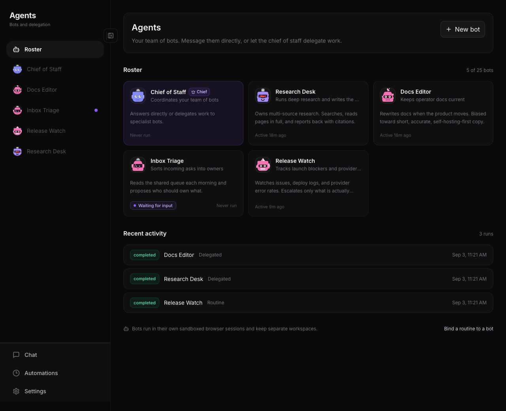

<b>See what the crew is doing</b><br />
<sub>Each bot also gets its own browser, so it can navigate and stay logged in to sites on its own.</sub>

</td>
<td width="50%">

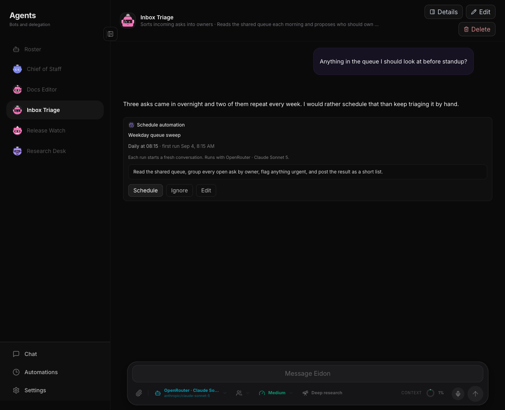

<b>They ask first</b><br />
<sub>A bot that notices repeating work offers to schedule it, then waits for your answer.</sub>

</td>
</tr>
</table>

## Deep research

Turn on **Deep research** and Eidon writes a detailed plan before it starts it's search. Change the steps however
you want, then let it run.

<table>
<tr>
<td width="50%">

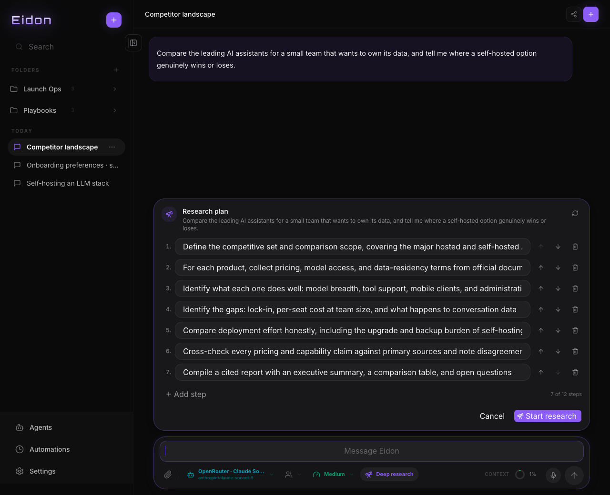

<b>You approve the plan</b><br />
<sub>Edit, reorder, or remove any step. Nothing runs until you say so.</sub>

</td>
<td width="50%">

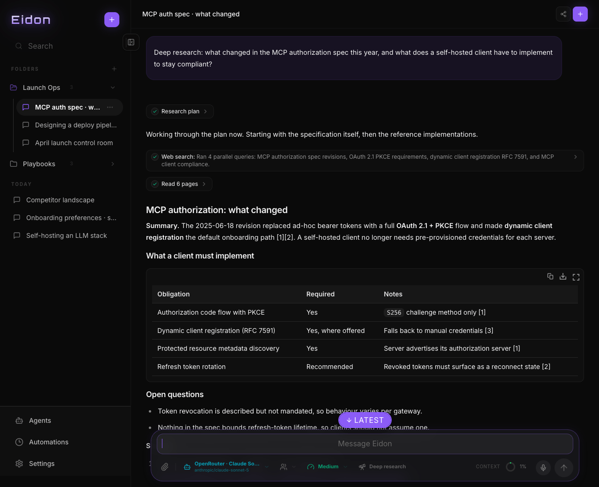

<b>You get a report with sources</b><br />
<sub>It searches, reads the pages in full, and links everything it used.</sub>

</td>
</tr>
</table>

## Automations

Support for automations of tasks. Every couple of minutes, or at a set time each day or week.
Every run is saved as a chat you can open and read.

<table>
<tr>
<td width="50%">


<b>Every run is kept</b><br />
<sub>Run one now, retry one that failed, or review older runs.</sub>

</td>
<td width="50%">

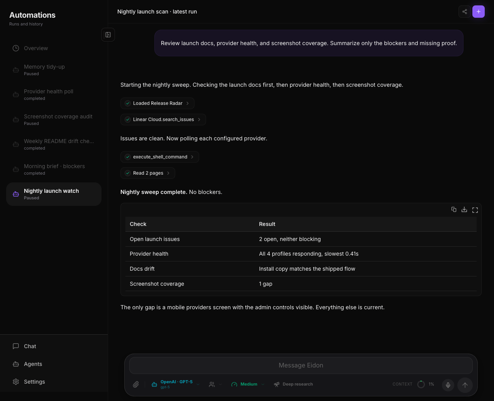

<b>See what it did</b><br />
<sub>The whole run, step by step, not just the final answer.</sub>

</td>
</tr>
</table>

## Memory

Eidon picks up on things worth remembering — what you are working on, who is involved, how
you like your answers — and brings them back in later conversations without you repeating
yourself.

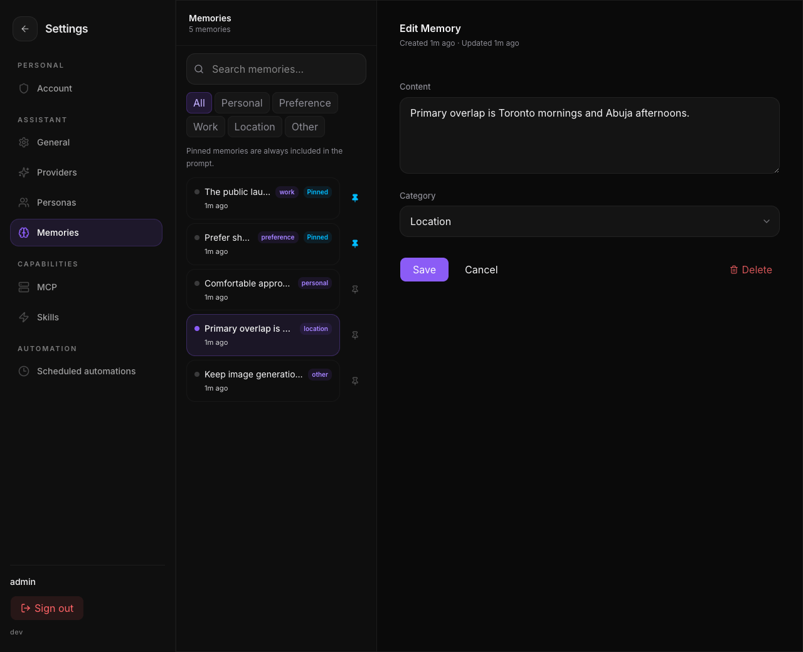

- It asks before saving anything, so nothing is stored behind your back.
- Search, edit, or delete anything it has remembered.
- Pin the things that are important and must be added to all chats at all time.

## Tools

Web search, reading web pages, image generation, looking at images, and running commands are
all built in. Add more with MCP (local or remote).

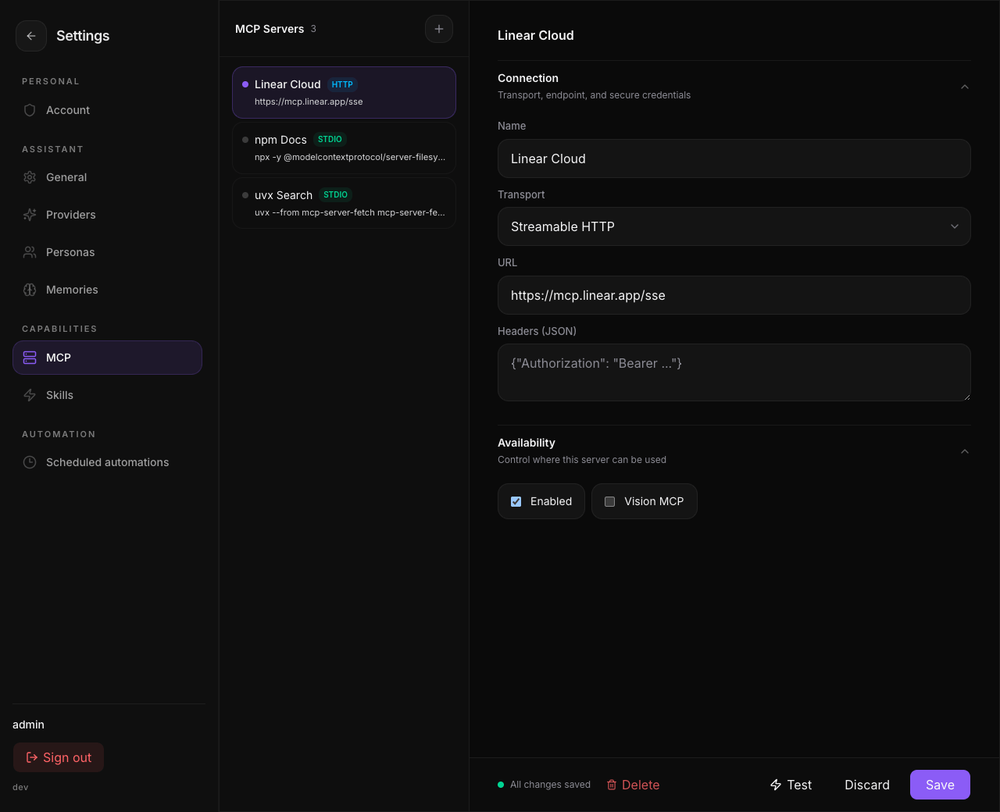

Full list in [Features](./docs/features.md).

## Diagrams, code, and math

<table>
<tr>
<td width="50%">

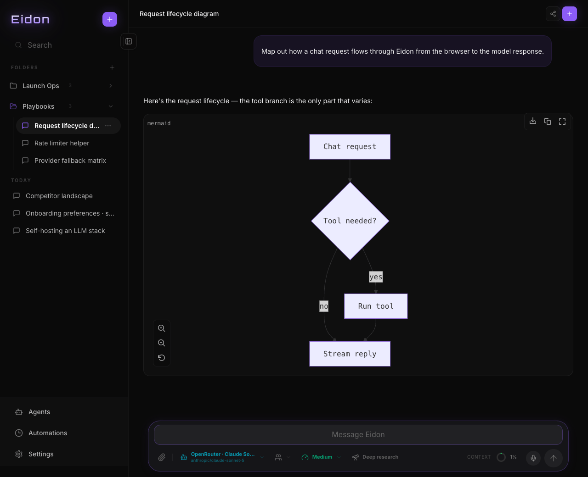

<b>Mermaid diagrams</b>

</td>
<td width="50%">

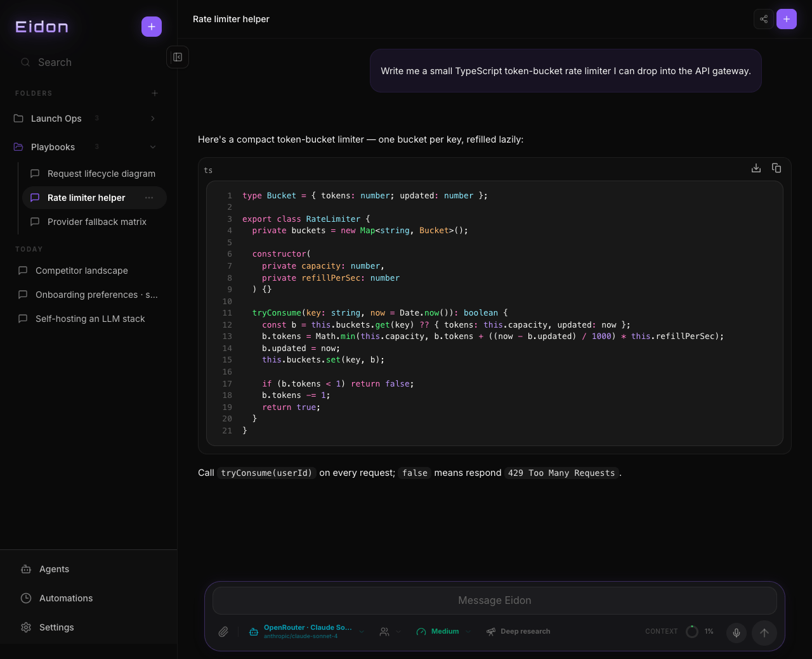

<b>Code and math</b>

</td>
</tr>
</table>

## Providers

<p>
  
  
  
  
  
  
  
  
  
  
  
  
  
  
  
  
  
  
  
  
  <br />
  
</p>

Eidon supports most of the big providers out of the box, and you can bring any other
OpenAI- or Anthropic-compatible service you want — including Ollama or LM Studio running on
your own machine.

Set up as many as you like and switch between them in any chat. Your keys are encrypted.


Setup for each one is in [Providers](./docs/providers.md).

## On your phone

Add Eidon to your home screen from the browser and it opens like a normal app. The layout is
built for a phone, not a shrunk-down desktop. A native iOS app is coming soon.

<p align="center">
  
  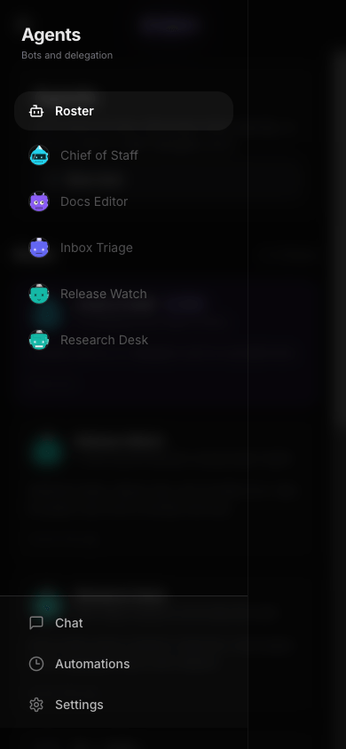
  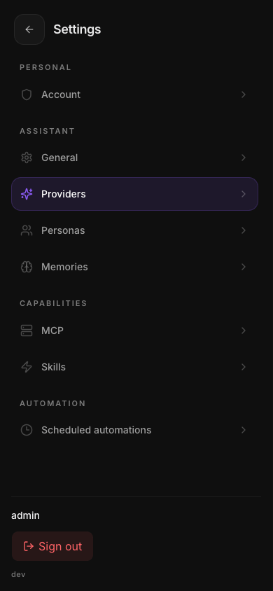
</p>

## Why Eidon

One Docker container, running in minutes, and you have the whole thing: agents doing real
work, everyday chat, and automations on a schedule.

- **Start in minutes.** One container and one volume. Nothing else to wire together.
- **Everything in one place.** Agents, automations, memory, tools, and multiple users are all
  part of it.
- **Bring your own model.** No expensive per-person subscription, and nothing tying you to one
  company's ecosystem.
- **Your chats stay on your server**, in one file you can copy and back up.
- **Open source**, under AGPL-3.0.

## Documentation

| Guide | What it covers |
| --- | --- |
| [Configuration](./docs/configuration.md) | Settings, secrets, where your data lives, backups |
| [Providers](./docs/providers.md) | Setting up each provider, web search, images, voice |
| [MCP and skills](./docs/mcp-and-skills.md) | Adding tools and writing your own skills |
| [Features](./docs/features.md) | Everything Eidon can do |
| [Development](./docs/development.md) | Running it locally and how it is built |

## License

[AGPL-3.0-only](./LICENSE).

## AI-assisted development

Eidon is built partly with AI help. Every change is reviewed before it goes in.

<div align="right"><a href="#readme-top">Back to top ↑</a></div>
