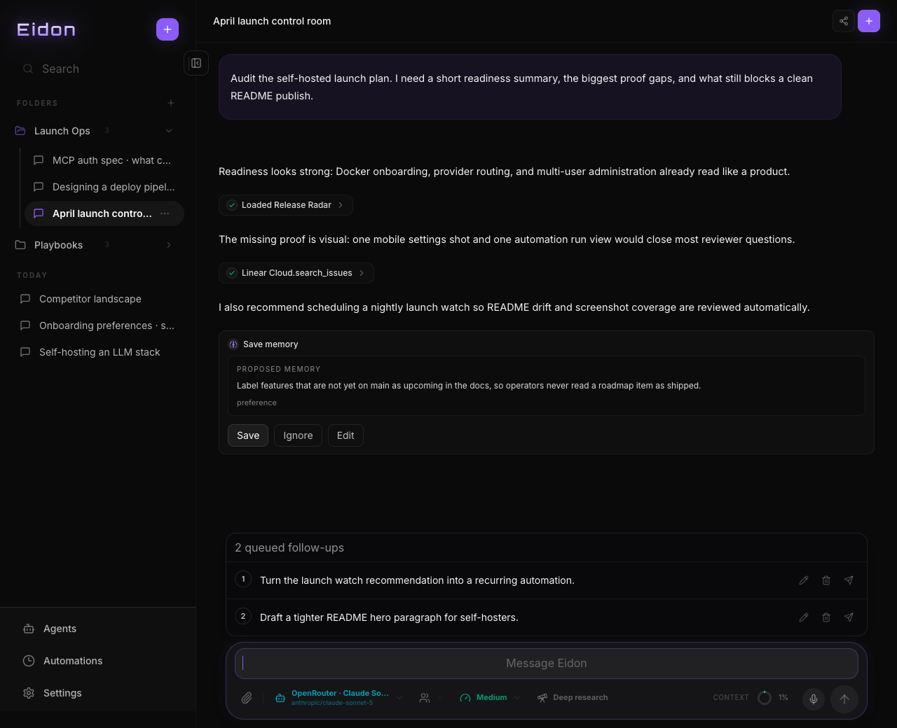
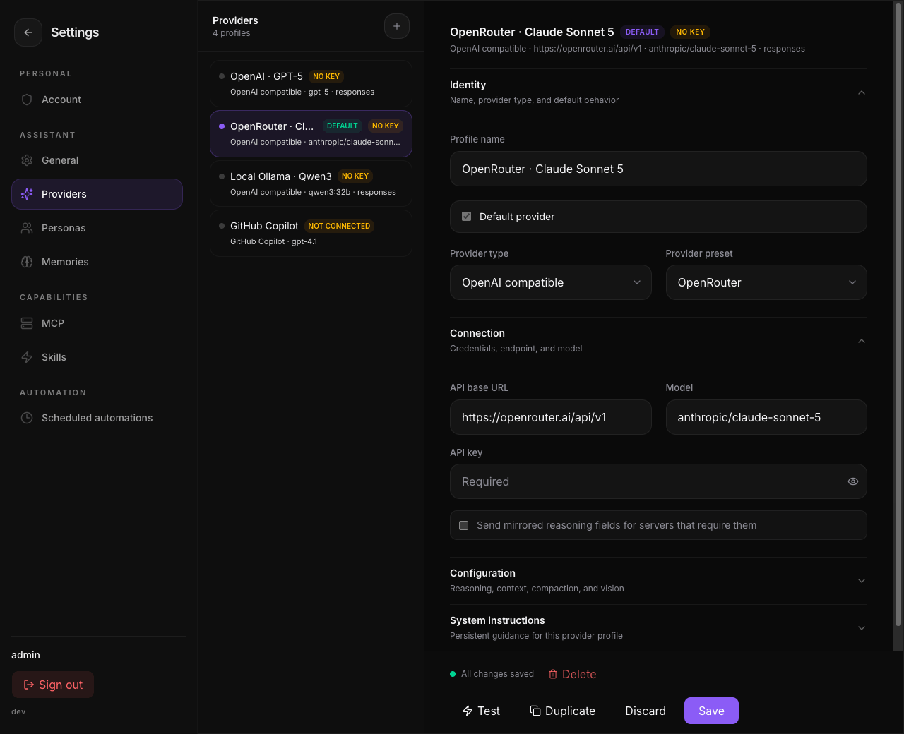
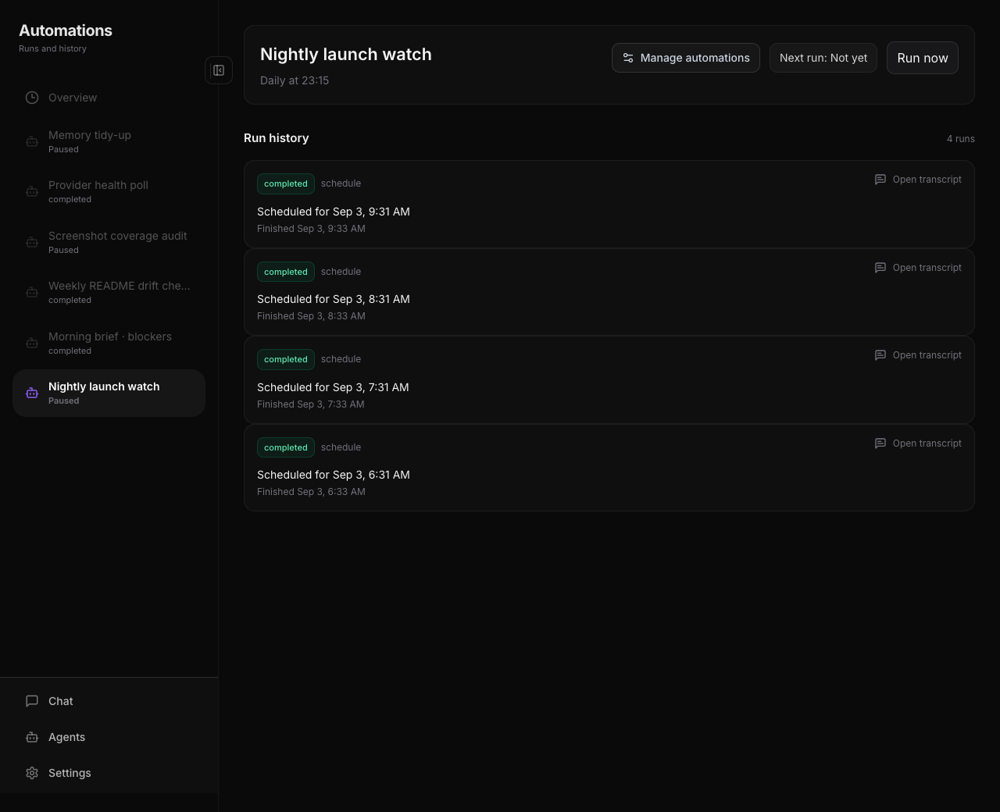
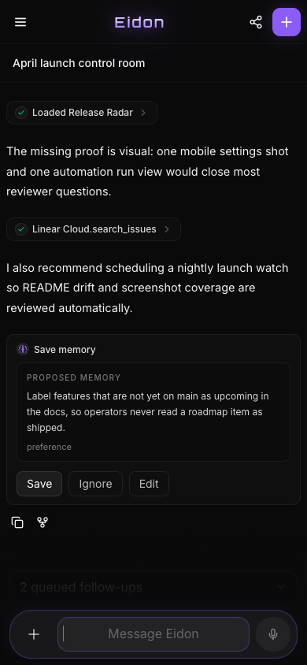
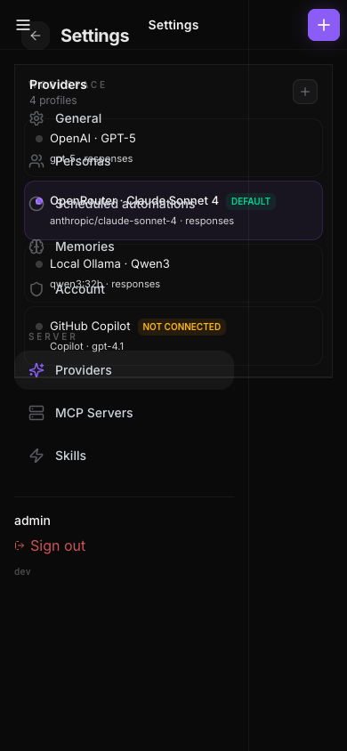

<div align="center">
  
  <br />
  

  <p>
    <strong>Eidon is a powerful BYOK AI assistant for everyday work, bundled into one easy self-hosted Docker image.</strong>
  </p>

  <p>
    <a href="#what-is-eidon">What is Eidon?</a>
    ·
    <a href="#feature-highlights">Features</a>
    ·
    <a href="#supported-providers">Providers</a>
    ·
    <a href="#screenshots">Screenshots</a>
    ·
    <a href="#quick-start">Quick Start</a>
    ·
    <a href="#github-copilot-provider">GitHub Copilot</a>
    ·
    <a href="#configuration-essentials">Configuration</a>
    ·
    <a href="#local-development">Local Development</a>
    ·
    <a href="#security--storage-notes">Security</a>
  </p>

  <p>
    
    
    
    
    
  </p>
</div>

## What is Eidon?

Eidon is a self-hostable AI assistant workspace for everyday work. It runs as one Docker image, stores app data locally, and lets you connect the model providers you already trust instead of committing to a locked-in hosted platform.

Use it as a private assistant, a day-to-day work companion, or a shared workspace for a group. Eidon packages the chat experience, tool layer, memory, automation, and administration pieces behind a responsive UI that is easy to use and easy to self-host.

## Feature Highlights

- Single self-hostable Docker image with SQLite-backed persistence under `/app/data`
- Bring-your-own-provider model routing instead of a locked-in hosted backend
- Built-in web browsing through the bundled `agent-browser` skill
- Built-in web search with Exa, Tavily, or SearXNG
- Automatic memory system with conversation compaction for long-running threads
- Reusable skills stored in-app and available across chats
- MCP server support over `streamable_http` and `stdio`, including OAuth sign-in for remote servers
- Docker image already includes both `uvx` and `npx` for `stdio` MCP workflows
- Scheduled automations with run history and transcript views
- Personas you can switch in the composer to change assistant behavior per task
- Full mobile PWA support for chat and admin flows
- Streaming chat with visible action timelines
- Multi-user workspace with `admin` and `user` roles
- Multiple provider profiles per workspace, including OpenAI-compatible endpoints
- Chat forking from assistant replies when you want to branch a thread without losing context
- Shareable chat conversations for sending read-only transcript links
- Previous message editing with restart-from-edit flow for fast iteration
- Browser-native, self-hosted model, or external provider (ElevenLabs and AssemblyAI) speech-to-text in the chat composer
- Image generation support
- Mermaid diagram generation
- Multiple clients live sync
- Support native or dedicated MCP server for vision capabilites
- Temporary chat

## Supported Providers

Eidon currently supports these provider options:

- OpenAI-compatible endpoints, including OpenAI and other compatible APIs
- Anthropic-compatible endpoints, including the official Anthropic API
- OpenRouter
- Ollama Cloud
- GLM Coding Plan
- OpenCode Go
- GitHub Copilot

The OpenAI-compatible and Anthropic-compatible profiles are manually configurable, so any service that exposes an OpenAI-compatible or Anthropic Messages API can be connected through the matching provider type.

## Screenshots



<p align="center">
  <em>Desktop workspace with sidebar navigation, provider switching, persona selection, queued follow-ups, and visible tool activity.</em>
</p>

| Desktop providers | Automation transcript |
| --- | --- |
|  |  |
| <sub>Multiple saved providers, presets, and admin settings in one workspace.</sub> | <sub>Scheduled automation output captured as a normal transcript you can review like any other chat.</sub> |

| Mobile chat | Mobile providers |
| --- | --- |
|  |  |
| <sub>Chat, queued work, and provider context on a phone-sized layout.</sub> | <sub>Provider administration still works cleanly on mobile.</sub> |

## Quick Start

### 1. Generate strong secrets on the host

```bash
export EIDON_ADMIN_PASSWORD="$(openssl rand -base64 24)"
export EIDON_SESSION_SECRET="$(openssl rand -hex 32)"
export EIDON_ENCRYPTION_SECRET="$(openssl rand -hex 32)"
```

### 2. Run Eidon with `docker run`

```bash
docker run -d \
  --name eidon \
  --restart unless-stopped \
  -p 3000:3000 \
  -v eidon-data:/app/data \
  -e EIDON_PASSWORD_LOGIN_ENABLED=true \
  -e EIDON_ADMIN_USERNAME=admin \
  -e EIDON_ADMIN_PASSWORD="$EIDON_ADMIN_PASSWORD" \
  -e EIDON_SESSION_SECRET="$EIDON_SESSION_SECRET" \
  -e EIDON_ENCRYPTION_SECRET="$EIDON_ENCRYPTION_SECRET" \
  ghcr.io/quack6765/eidon-ai
```

### 3. Or run it with Docker Compose

```yaml
services:
  eidon:
    image: ghcr.io/quack6765/eidon-ai
    restart: unless-stopped
    ports:
      - "3000:3000"
    environment:
      EIDON_PASSWORD_LOGIN_ENABLED: "true"
      EIDON_ADMIN_USERNAME: "admin"
      EIDON_ADMIN_PASSWORD: "${EIDON_ADMIN_PASSWORD}"
      EIDON_SESSION_SECRET: "${EIDON_SESSION_SECRET}"
      EIDON_ENCRYPTION_SECRET: "${EIDON_ENCRYPTION_SECRET}"
    volumes:
      - eidon-data:/app/data

volumes:
  eidon-data:
```

Start it with the exported variables above, or put the same values in a local `.env` file before launching:

```bash
docker compose up -d
```

### 4. First login

1. Open your Eidon URL.
2. Sign in with `EIDON_ADMIN_USERNAME` and `EIDON_ADMIN_PASSWORD`.
3. Go to **Settings → Providers**.
4. Add your provider API key or connect GitHub Copilot.
5. Start chatting.

Eidon does not ship with a provider API key. The deployment is ready first; you bring the model access you want to use.

## Why the Docker Image Is Different

The production image is meant to be useful on its own, not just a way to serve the UI.

- It runs as a non-root user
- Runtime data lives under `/app/data`
- Password login is supported out of the box
- The browser automation skill is bundled
- `uvx`, `npx`, and Chromium are available for MCP and browser-backed workflows

## MCP OAuth

Remote MCP servers that follow the [MCP authorization spec](https://modelcontextprotocol.io/specification/2025-06-18/basic/authorization) (OAuth 2.1 with PKCE) can be connected with a browser sign-in instead of pasting static API keys. This works with hosted MCP gateways such as [Composio Connect](https://docs.composio.dev/docs/composio-connect):

1. Open **Settings → MCP** and add a server with the Streamable HTTP transport, for example `https://connect.composio.dev/mcp`.
2. Click **Test**. Eidon detects the server requires authentication and shows an **Authenticate** button.
3. Click **Authenticate** and approve the provider's consent page.
4. You are redirected back to the MCP servers settings with the server connected and its tools available.

The first sign-in registers Eidon with the provider automatically via OAuth dynamic client registration; no client credentials need to be configured. The registration includes Eidon's name, avatar, and public URL, so providers can show the app's branding on their consent page. Access and refresh tokens are encrypted with `EIDON_ENCRYPTION_SECRET` and stored in the SQLite database under `/app/data`, so they survive container restarts and recreation. Expired access tokens are refreshed automatically, and a server whose refresh token has been revoked shows an **Authentication expired** state with a one-click reconnect.

Keep `EIDON_ENCRYPTION_SECRET` stable across deployments: changing it makes previously stored MCP OAuth tokens (and other stored credentials) undecryptable, and the servers will need to be reconnected.

## GitHub Copilot Provider

Eidon can route chats through your GitHub Copilot subscription instead of a direct provider API key. To enable the OAuth flow, register a GitHub App and set:

```bash
EIDON_GITHUB_APP_CLIENT_ID=Iv1.xxxxxxxx
EIDON_GITHUB_APP_CLIENT_SECRET=xxxxxxxxxxxxxxxxxxxxxxxxxxxxxxxxxxxxxxxx
EIDON_GITHUB_APP_CALLBACK_URL=https://your-host/api/providers/github/callback
```

### Create the GitHub App

1. Go to [github.com/settings/developers](https://github.com/settings/developers) and create a new GitHub App.
2. Use your Eidon URL as the homepage.
3. Set the callback URL to `https://<your-host>/api/providers/github/callback`.
4. Under user authorization, enable OAuth during installation.
5. Copy the Client ID and generate a Client Secret.

### Connect a Copilot profile

1. Open **Settings → Providers**.
2. Add a profile and switch **Provider type** to **GitHub Copilot**.
3. Click **Connect GitHub**.
4. Approve the authorization flow.
5. Pick a model and start chatting.

If those three environment variables are not set, the GitHub Copilot profile type is still visible in settings, but the OAuth connection flow will not work. Set all three values before using **Connect GitHub**.

## Configuration Essentials

| Variable | Purpose | Required in production |
| --- | --- | --- |
| `EIDON_PASSWORD_LOGIN_ENABLED` | Enables password-based login | No, but `true` is the normal production mode |
| `EIDON_ADMIN_USERNAME` | Initial admin username | Yes |
| `EIDON_ADMIN_PASSWORD` | Initial admin password | Yes |
| `EIDON_SESSION_SECRET` | Session signing secret | Yes |
| `EIDON_ENCRYPTION_SECRET` | Encryption seed for stored provider credentials, MCP secrets, and MCP OAuth tokens | Yes |
| `EIDON_DATA_DIR` | Directory for SQLite and runtime data | No |
| `EIDON_GITHUB_APP_CLIENT_ID` | GitHub App client ID for the Copilot provider | No |
| `EIDON_GITHUB_APP_CLIENT_SECRET` | GitHub App client secret for the Copilot provider | No |
| `EIDON_GITHUB_APP_CALLBACK_URL` | OAuth callback URL for Copilot | No |

Useful defaults:

- Default model: `gpt-5-mini`
- Default API mode: `responses`
- Default Docker data path: `/app/data`

Generate secrets on macOS or Linux with:

```bash
openssl rand -hex 32
openssl rand -hex 32
```

## Testing Pre-release Builds

Two image channels are published from GitHub:

| Channel | Image tags | Published when |
| --- | --- | --- |
| Stable | `:latest`, `:<release version>` | A GitHub release is cut from `main` |
| Dev | `:dev`, `:dev-<commit sha>` | Every push to the `dev` branch |

Most users should stay on the stable channel, which only moves when a release is cut. If you want to test changes before they are released, merge them into `dev`, then run the dev image alongside your stable instance with its own data volume and port (save as `docker-compose.dev.yml`):

```yaml
services:
  eidon-dev:
    image: ghcr.io/quack6765/eidon-ai:dev
    restart: unless-stopped
    ports:
      - "3001:3000"
    environment:
      EIDON_PASSWORD_LOGIN_ENABLED: "true"
      EIDON_ADMIN_USERNAME: "admin"
      EIDON_ADMIN_PASSWORD: "${EIDON_ADMIN_PASSWORD}"
      EIDON_SESSION_SECRET: "${EIDON_SESSION_SECRET}"
      EIDON_ENCRYPTION_SECRET: "${EIDON_ENCRYPTION_SECRET}"
    volumes:
      - eidon-dev-data:/app/data

volumes:
  eidon-dev-data:
```

The `:dev` tag is mutable and always points at the latest `dev` build, so pull before restarting:

```bash
docker compose -f docker-compose.dev.yml pull
docker compose -f docker-compose.dev.yml up -d
```

The in-app version shows `dev-<commit sha>`, so you can confirm exactly which build you are testing.

## Local Development

### Prerequisites

- Node.js 22+
- npm
- A local toolchain capable of building `better-sqlite3`

### Install and start

```bash
npm install
```

Create a local `.env`:

```bash
EIDON_PASSWORD_LOGIN_ENABLED=false
EIDON_ADMIN_USERNAME=admin
EIDON_ADMIN_PASSWORD=dev-password-change-me
EIDON_SESSION_SECRET=dev-session-secret-change-me-with-32-plus-chars
EIDON_ENCRYPTION_SECRET=dev-encryption-secret-change-me-with-32-plus-chars
```

Run the app:

```bash
npm run dev
```

Open [http://localhost:3000](http://localhost:3000).

`npm run dev` uses the custom websocket server, which is required for the realtime chat runtime. `npm run dev:next` is available when you explicitly want plain Next.js without that websocket layer.

### Useful commands

| Command | Purpose |
| --- | --- |
| `npm run dev` | Start the websocket-enabled dev server |
| `npm run dev:next` | Start plain Next.js without the websocket runtime |
| `npm run lint` | Run ESLint |
| `npm run typecheck` | Run TypeScript checks |
| `npm run test` | Run unit tests with coverage |
| `npm run test:e2e` | Run Playwright smoke and feature tests |
| `npm run seed:readme-demo` | Create the disposable README screenshot dataset under `.context/readme-demo-data` |

## License

Eidon is licensed under the GNU Affero General Public License v3.0 (`AGPL-3.0-only`). See [LICENSE](./LICENSE).

## AI-Assisted Development

Eidon is developed in part with AI assistance. All code is carefully reviewed before it is accepted.
