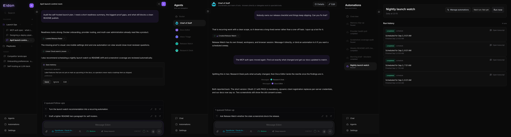

<a name="readme-top"></a>

<div align="center">
  
  <br />
  

  <p>
    <strong>A self-hosted AI workspace you actually own.</strong><br />
    Bring your own model provider. One Docker image. Your data stays on your disk.
  </p>

  <p>
    <a href="#quick-start"><b>Quick start</b></a>
    ·
    <a href="#chat-that-shows-its-work"><b>Features</b></a>
    ·
    <a href="#bring-your-own-provider"><b>Providers</b></a>
    ·
    <a href="./docs/configuration.md"><b>Configuration</b></a>
    ·
    <a href="#documentation"><b>Docs</b></a>
  </p>

  <p>
    <a href="https://github.com/Quack6765/Eidon-AI/actions/workflows/test.yml"></a>
    <a href="https://github.com/Quack6765/Eidon-AI/releases"></a>
    <a href="https://github.com/Quack6765/Eidon-AI/pkgs/container/eidon-ai"></a>
    <a href="./LICENSE"></a>
    
  </p>

  
</div>

Eidon is a self-hostable AI assistant workspace that runs as a single Docker image and
stores everything in SQLite on a volume you control. You connect the model providers you
already pay for instead of renting a seat on someone else's platform.

It is three places to work: **Chat** for everyday conversations, **Agents** for a team of
persistent bots that message each other, and **Automations** for work that should run on a
schedule without you.

> [!NOTE]
> Self-hosting is real work. You run the container, keep it updated, and own your backups.
> Eidon does not ship an API key — you bring the model access you want to use.

## Quick start

```bash
export EIDON_ADMIN_PASSWORD="$(openssl rand -base64 24)"
export EIDON_SESSION_SECRET="$(openssl rand -hex 32)"
export EIDON_ENCRYPTION_SECRET="$(openssl rand -hex 32)"

docker run -d --name eidon --restart unless-stopped \
  -p 3000:3000 -v eidon-data:/app/data \
  -e EIDON_PASSWORD_LOGIN_ENABLED=true \
  -e EIDON_ADMIN_USERNAME=admin \
  -e EIDON_ADMIN_PASSWORD="$EIDON_ADMIN_PASSWORD" \
  -e EIDON_SESSION_SECRET="$EIDON_SESSION_SECRET" \
  -e EIDON_ENCRYPTION_SECRET="$EIDON_ENCRYPTION_SECRET" \
  ghcr.io/quack6765/eidon-ai
```

Open your Eidon URL, sign in, go to **Settings → Providers**, add a key, and start chatting.

<details>
<summary><kbd>Docker Compose</kbd></summary>

```yaml
services:
  eidon:
    image: ghcr.io/quack6765/eidon-ai
    restart: unless-stopped
    ports:
      - "3000:3000"
    environment:
      EIDON_PASSWORD_LOGIN_ENABLED: "true"
      EIDON_ADMIN_USERNAME: "admin"
      EIDON_ADMIN_PASSWORD: "${EIDON_ADMIN_PASSWORD}"
      EIDON_SESSION_SECRET: "${EIDON_SESSION_SECRET}"
      EIDON_ENCRYPTION_SECRET: "${EIDON_ENCRYPTION_SECRET}"
    volumes:
      - eidon-data:/app/data

volumes:
  eidon-data:
```

Keep `EIDON_ENCRYPTION_SECRET` stable across deployments — it decrypts your stored
provider keys and MCP tokens. Full reference in [Configuration](./docs/configuration.md).

</details>

## Chat that shows its work

Every turn is a visible timeline: which skill loaded, which tool ran, what it returned.
Nothing important happens off-screen.


- **You approve what it remembers.** When the assistant wants to save a memory it proposes
  it — you save, edit, or ignore. Same flow for automations it wants to create.
- **Queue follow-ups while it works.** Reorder them, edit them, or send one next.
- **Fork from any reply** to branch a thread, or edit an earlier message and restart from there.
- **Context gauge and compaction** so long threads keep working instead of falling over.

## Agents that hand work to each other

The **Agents** area gives you a team of persistent bots. A Chief of Staff is created for
you: message it directly and it answers, delegates, or proposes a new specialist bot when a
job deserves a long-lived owner.


Delegation is peer-to-peer — any bot can message any other bot, not just the chief. The
sender keeps working while the target runs in its own thread, and the reply comes back into
the conversation.

<table>
<tr>
<td width="50%">


<b>A roster with live status</b><br />
<sub>Each bot has its own thread, memory, avatar, and an isolated sandbox: its own file
workspace and its own browser session with its own logins.</sub>

</td>
<td width="50%">


<b>Bots ask before they commit</b><br />
<sub>A bot that spots repeating work proposes an automation and waits. It shows as
<i>waiting for input</i> on the roster until you decide.</sub>

</td>
</tr>
</table>

## Deep research with a plan you control

Toggle **Deep research** and Eidon drafts a research plan before spending anything. Edit the
steps, reorder them, delete them, add your own — then start it.

<table>
<tr>
<td width="50%">


<b>Approve the plan first</b><br />
<sub>Up to 12 steps, each one editable. Regenerate it or cancel before any tool runs.</sub>

</td>
<td width="50%">


<b>Get a cited report back</b><br />
<sub>Multi-query search, full-page reads, corroboration across sources, and a report with
inline citations and a sources list.</sub>

</td>
</tr>
</table>

## Automations that run without you

Interval or calendar schedules, each with its own provider profile and persona. Every run is
a real transcript you can open and read like any other conversation.

<table>
<tr>
<td width="50%">


<b>Schedules and run history</b><br />
<sub>Run now, retry a failed run, or bind an automation to a bot so it runs as a routine in
that bot's thread.</sub>

</td>
<td width="50%">


<b>Every run is auditable</b><br />
<sub>The full timeline — searches, page reads, shell commands — not just the summary.</sub>

</td>
</tr>
</table>

## Memory, tools, and MCP

<table>
<tr>
<td width="50%">


<b>Memory you can read and edit</b><br />
<sub>Browse, search, and pin memories so they always stay in the prompt. Semantic recall
indexes past messages and attachments locally.</sub>

</td>
<td width="50%">


<b>MCP over HTTP or stdio</b><br />
<sub>The image ships <code>uvx</code> and <code>npx</code>, so stdio servers work out of the
box. Remote servers can sign in with OAuth instead of pasted keys.</sub>

</td>
</tr>
</table>

Built in: web search across Exa, Tavily, or a self-hosted SearXNG · full-page reading ·
image generation · vision · shell commands · reusable skills · a bundled browser-automation
skill with Chromium. See [Features](./docs/features.md).

## Renders what the answer needs

<table>
<tr>
<td width="50%">


<b>Mermaid diagrams</b>

</td>
<td width="50%">


<b>Code, and LaTeX math</b>

</td>
</tr>
</table>

## Bring your own provider

<p>
  
  
  
  
  
  
  
  
  
  
  
  
  
  
  
  
  
  
  
  
  <br />
  
</p>

Nine of these are one-click presets. The rest work because Eidon speaks the OpenAI and
Anthropic Messages APIs — point a profile at any compatible endpoint, including a local
Ollama or LM Studio. Keep several profiles side by side and switch per conversation, each
with its own reasoning effort, context limit, and vision routing. Credentials are encrypted
at rest.


Setup for every provider, including the GitHub Copilot OAuth app, is in
[Providers](./docs/providers.md).

## Install it on your phone

Eidon is an installable PWA — add it to your home screen and it runs standalone, with
layouts built for a phone rather than a shrunken desktop.

<p align="center">
  
  
  
</p>

## Why self-host this

- **No per-seat subscription.** You pay your provider for tokens you actually use. A local
  model through Ollama costs nothing per message.
- **Your conversations sit on your disk**, in a SQLite file you can copy, grep, and back up.
- **Any model, and more than one.** Route reasoning, coding, and vision to different
  providers in the same workspace, and change your mind without redeploying.
- **It is a workspace, not a chat box.** Agents, schedules, memory, tools, MCP, and
  multi-user administration are built in rather than assembled.
- **No lock-in.** AGPL-3.0, one container, and a documented export path.

## Alternatives

Worth knowing about before you pick Eidon:

- **ChatGPT / Claude.ai** — the polish bar, and genuinely excellent. Use them if you do not
  care where your conversations live. Eidon exists for when you do.
- **[Open WebUI](https://github.com/open-webui/open-webui)** — the most established
  self-hosted chat UI, with a much larger plugin ecosystem. Eidon is lighter to run and
  leans harder on agents and scheduled work.
- **[LibreChat](https://github.com/danny-avila/LibreChat)** — closest in scope, with strong
  multi-provider support. Worth a look if you want a bigger community.
- **[Jan](https://github.com/menloresearch/jan)** — desktop-first and fully local. Pick Jan
  if you never want a server; pick Eidon if you want a shared, multi-user workspace.

## Documentation

| Guide | What is in it |
| --- | --- |
| [Configuration](./docs/configuration.md) | Environment variables, secrets, data storage, security notes, backup and restore |
| [Providers](./docs/providers.md) | All presets, per-profile settings, GitHub Copilot, web search, image generation, speech-to-text |
| [MCP and skills](./docs/mcp-and-skills.md) | Transports, OAuth sign-in, vision MCP, writing skills, the bundled browser skill |
| [Features](./docs/features.md) | The complete capability reference |
| [Development](./docs/development.md) | Local setup, scripts, tests, image channels, architecture, mobile API |

## License

[AGPL-3.0-only](./LICENSE).

## AI-assisted development

Eidon is developed in part with AI assistance. All code is reviewed before it is accepted.

<div align="right"><a href="#readme-top">Back to top ↑</a></div>
