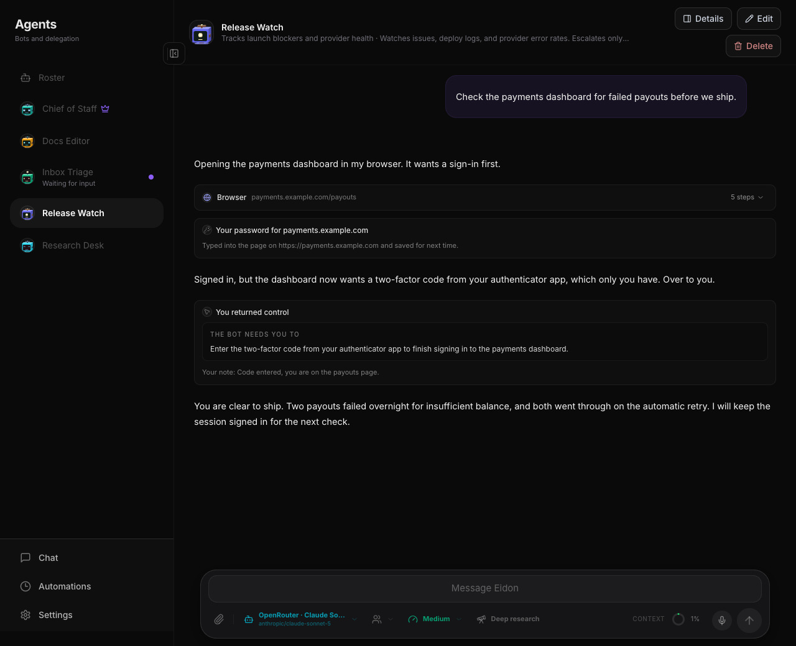
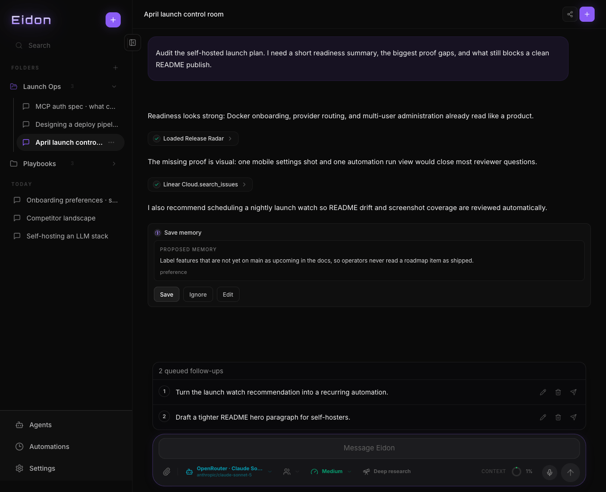
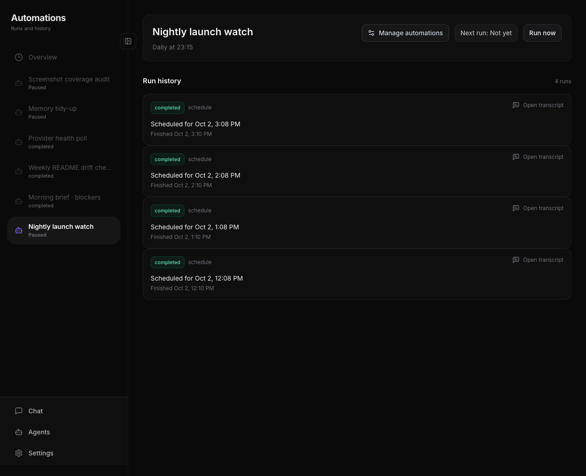
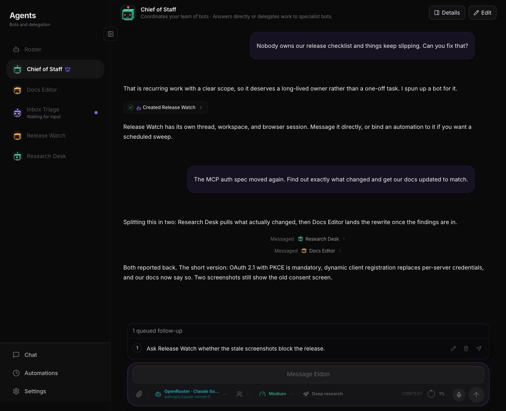
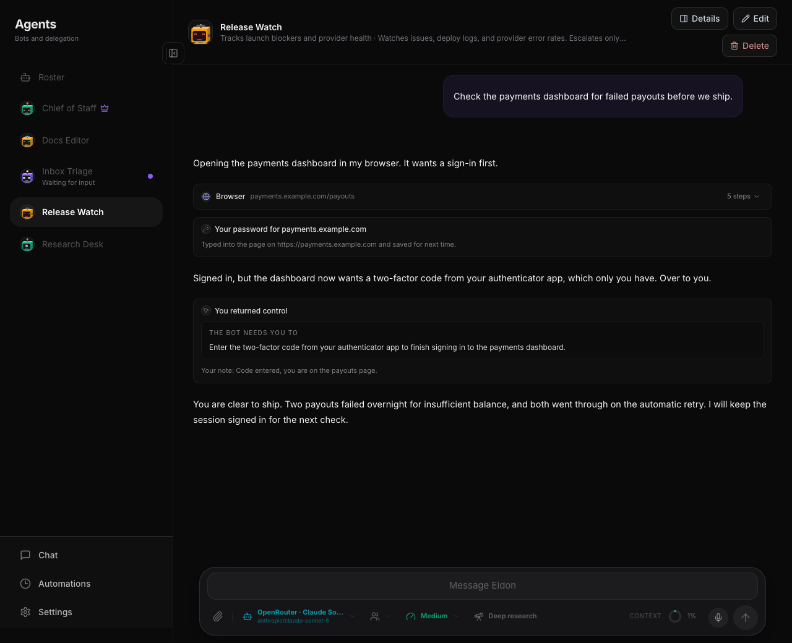
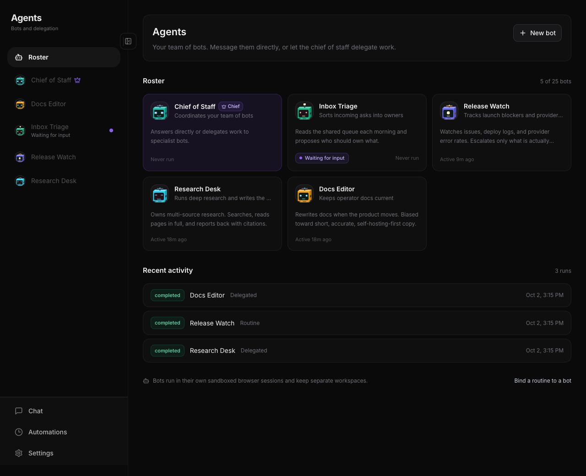
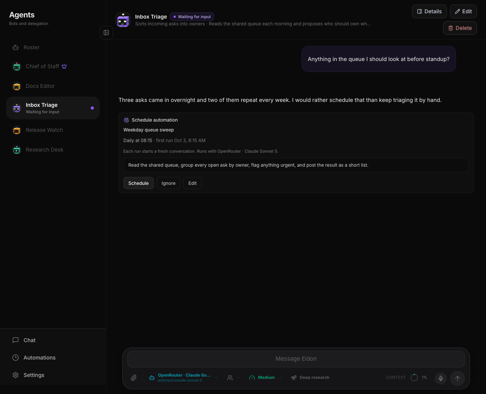
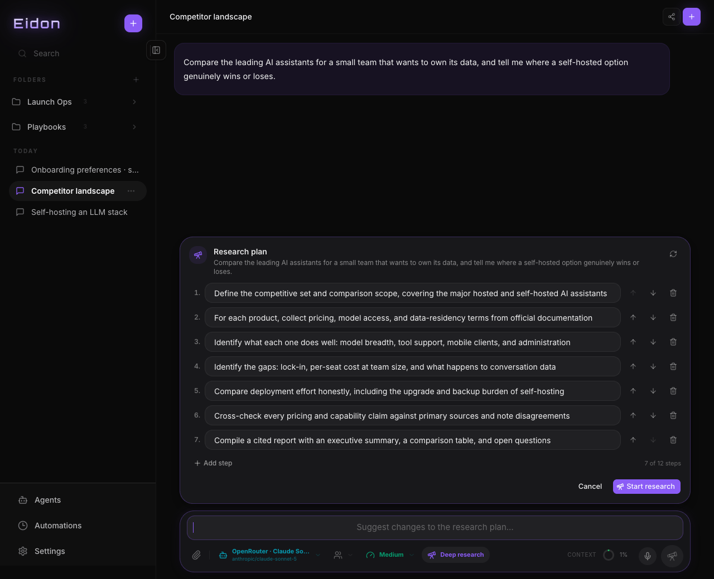
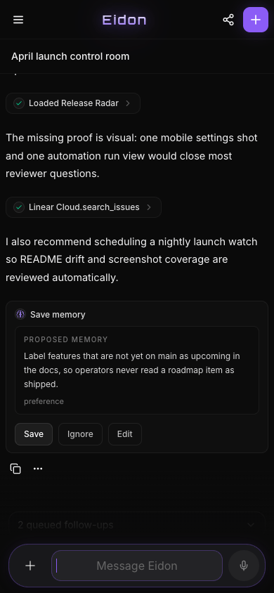
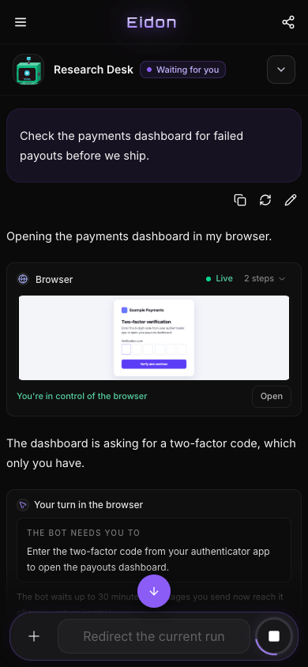

<a name="readme-top"></a>

<div align="center">
  
  <br />
  <a href="https://eidonai.app"><b>eidonai.app</b></a>

  <p>
    <strong>A self-hosted AI platform with a team of agents, and a chat for everything else.</strong><br />
    One Docker image. Your own model keys. Your data stays on your server.
  </p>

  <p>
    <a href="#-quick-start"><b>Quick start</b></a>
    ·
    <a href="#-agents"><b>Agents</b></a>
    ·
    <a href="#-chat"><b>Chat</b></a>
    ·
    <a href="#works-with-the-ai-you-already-use"><b>Providers</b></a>
    ·
    <a href="./docs/configuration.md"><b>Configuration</b></a>
    ·
    <a href="#-documentation"><b>Docs</b></a>
  </p>

  <p>
    <a href="https://github.com/Quack6765/Eidon-AI/releases"></a>
    <a href="https://github.com/Quack6765/Eidon-AI/pkgs/container/eidon-ai"></a>
    <a href="./LICENSE"></a>
    
  </p>

  <table>
    <tr>
      <td width="33%" align="center">
        <a href="./.github/readme/desktop-agent-browser.png"></a>
        <br /><b>Agents</b>
      </td>
      <td width="33%" align="center">
        <a href="./.github/readme/desktop-chat.png"></a>
        <br /><b>Chat</b>
      </td>
      <td width="33%" align="center">
        <a href="./.github/readme/desktop-automations.png"></a>
        <br /><b>Automations</b>
      </td>
    </tr>
  </table>

  <sub>Click any screenshot to see it full size.</sub>
</div>

Eidon is a self-hosted AI platform. It is a **team of agents** that do work on their own, in
their own browsers, and an **everyday chat** for the questions that do not need a team. It runs
as one Docker image, keeps your data in a single file on your server, and works with the model
providers you already use.

<table>
<tr>
<td valign="top" width="50%">

**🤖 A team of agents**

- A Chief of Staff that delegates to specialist agents
- Agents message each other to split the work
- Each agent has its own browser, memory, and files
- Watch an agent browse live and take over for logins
- Passwords are typed in for the agent, never sent to the model
- Approve commands and tools, and review drafts before they send

</td>
<td valign="top" width="50%">

**💬 An everyday chat**

- A plain conversation when you do not need a team
- Memory that you approve, edit, and pin
- Rewind, fork, or edit any message
- Folders, search, personas, and temporary chats
- Voice input, files, and images
- Read-only share links

</td>
</tr>
<tr>
<td valign="top" width="50%">

**⚡ Everything built-in**

- Web search, page reading, and a built-in browser
- Deep research with an editable plan
- MCP servers and skills
- Image generation and vision
- Code, Mermaid diagrams, and LaTeX math
- Scheduled automations and phone alerts

</td>
<td valign="top" width="50%">

**🏠 Self-hosted**

- One Docker image, one SQLite file, encrypted credentials
- Multiple users with private data
- Works with OpenAI, Anthropic, OpenRouter, Ollama, and many more
- Installable on your phone as an app
- Free and open source, AGPL-3.0

</td>
</tr>
</table>

## 🤖 Agents

**Use agents for work you would hand to a person.** They keep working while you do something
else, and they ask you only when they need you.

- ✈️ Find flights to Lisbon under $450 and check the hotels
- 📥 Sort your inbox every morning and draft the replies
- 🔎 Compare three vendors and come back with sources
- 🛠️ Fix a bug in a sandboxed workspace

Build a team, or let the Chief of Staff build it. Each agent has its own chat, memory, files,
and browser, and you step in whenever you want.

1. **Ask the Chief.** The Chief of Staff answers directly, passes the job to a specialist, or
   offers to create a new agent for it.
2. **Delegate.** Any agent can message any other agent. The one that asked keeps working, and
   the answer comes back to it when the other agent is done.
3. **Browse the web.** Agents open sites in their own browser, read them, fill in forms, and stay
   logged in.
4. **Report back.** You get the result in the chat, and you can open the message that went out
   and the reply that came back.
5. **Schedule it.** An agent that notices repeating work offers to run it on a schedule, then
   waits for your answer.



Make the team your own: a travel scout, an inbox triager, a research desk, a coding assistant
that works in its own sandboxed folder. Ask the Chief of Staff, or mention another agent with `@`
in an agent's chat, to have the request handed over.

### A browser of their own

Every agent gets a real browser. Its cookies and logins are never shared with another agent.


- **Watch it work.** While an agent browses, the chat shows its browser live. Scroll away and it
  floats in the corner as a small tile, so you keep watching.
- **Take over when it needs you.** When an agent reaches a login, a two-factor code, a CAPTCHA,
  or a payment, it pauses and asks. You click and type in its browser, then hand it back with
  an optional note, and it carries on from where you left it.
- **Passwords never reach the model.** An agent can ask for a password, and Eidon types it into
  the page for you. It is never sent to the model or written into the conversation. Save it for
  that site and agents stop asking.
- **Sandboxed.** Each agent's shell and browser run in their own box, with their own working
  folder.



### You stay in control

<table>
<tr>
<td width="50%">



<b>See what the team is doing</b><br />
<sub>Every agent shows whether it is working, idle, or waiting on you, and every run is listed with how it started.</sub>

</td>
<td width="50%">



<b>They ask first</b><br />
<sub>An agent that notices repeating work offers to schedule it, then waits for your answer.</sub>

</td>
</tr>
</table>

- **Approve what runs.** Allow an agent's shell commands and MCP tools once, always, or never.
- **Nothing goes out by surprise.** Emails and Slack messages are drafted first, so you can edit
  them before they are sent.
- **Stop or redirect at any time.** Stop one run or the whole chain, send a message mid-run to
  change course, or rewind to any earlier message.
- **Skills the whole team shares.** An agent can write a skill once, every agent can use it, and
  skills nobody uses are tidied away.
- **Files you can open.** What an agent produces lands in the chat as an attachment you can
  preview.

## 💬 Chat

**Use chat for the quick stuff.** Anything you can sort out in a single conversation, where you
steer each step yourself.

- 🧩 Explain an error message
- ✉️ Rewrite an email
- 📄 Summarize a PDF
- 🗓️ Plan a weekend
- 💭 Think out loud about a decision

Not every question needs a team. Open a normal conversation and just talk. No agents, no setup.


- **It remembers what matters.** Eidon offers to remember things that outlive the conversation,
  such as a birthday or a preference you keep stating. It asks first, and you can search, edit,
  pin, or delete every memory.
- **Change course any time.** Rewind to any message, branch off any reply, or rewrite an earlier
  message and carry on from there.
- **Keep typing while it works.** Follow-ups queue up in order.
- **Stay organized.** Folders, search, personas, temporary chats that stay out of your history,
  and read-only share links.
- **Talk or attach.** Dictate instead of typing, attach any file, or paste an image.
- **Long chats stay usable.** Older messages are condensed in the background, and Eidon tells you
  when it happens.

## ⚡ Everything you need is built in

Everything below works in the everyday chat and for every agent on your team.

<table>
<tr>
<td width="50%">



<b>Research in depth</b><br />
<sub>Turn on Deep research and approve the plan before anything runs. You get a report with sources.</sub>

</td>
<td width="50%">


<b>Work on a schedule</b><br />
<sub>Every few minutes, daily, weekly, or once. Every run is saved as a chat you can read.</sub>

</td>
</tr>
</table>

| Feature | What you get |
| --- | --- |
| **Web search** | Search with Exa (no key needed), Tavily, or your own SearXNG |
| **Read and browse the web** | Pages read in full, plus a built-in browser |
| **Deep research** | An editable plan, then a cited report |
| **Memory** | Global, approved by you, with pinned memories and semantic recall |
| **MCP** | Connect local or remote MCP servers as tools |
| **Skills** | Reusable instructions you write once and load when they are relevant |
| **Personas** | Saved instructions that change how it answers |
| **Image generation** | Create images from a prompt and keep them in the chat |
| **Vision** | Understand images natively, through MCP, or with a dedicated vision model |
| **Shell commands** | Run commands, with approval prompts when they matter |
| **Code, diagrams, and math** | Syntax highlighting, Mermaid diagrams, and LaTeX |
| **Files** | Attach any file; PDFs and text files are read for you |
| **Voice input** | Dictate with your browser, an offline model on your server, or ElevenLabs, AssemblyAI, Soniox |
| **Automations** | Scheduled and one-time runs, with full history, inside a chat or an agent |
| **Phone alerts** | Get notified when a run finishes: Pushover, ntfy, or the browser |

Full list in [Features](./docs/features.md).

## 🏠 Self-hosted

Eidon is free and open source. It runs on your own computer or server, and setup is one Docker
command. Bring your own model keys instead of paying a subscription per person for each
assistant.

- **Multiple users**, with admin and user roles, each with private data.
- **Nothing leaves your server.** Your chats live in one SQLite file you can copy and back up, and
  provider credentials are encrypted.
- **Installable on your phone.** Add it to your home screen and it opens like a normal app, with
  live sync across devices. A native iOS app is coming soon.

<p align="center">
  
  
</p>

### Works with the AI you already use

<p>
  
  
  
  
  
  
  
  
  
  
  
  
  
  
  
  
  
  
  
  
  
  <br />
  
</p>

Set up as many as you like and switch between them in any chat, including Ollama or LM Studio
running on your own machine. Setup for each one is in [Providers](./docs/providers.md).

## 🚀 Quick start

```bash
export EIDON_ADMIN_PASSWORD="$(openssl rand -base64 24)"
export EIDON_SESSION_SECRET="$(openssl rand -hex 32)"
export EIDON_ENCRYPTION_SECRET="$(openssl rand -hex 32)"

docker run -d --name eidon --restart unless-stopped \
  -p 3000:3000 -v eidon-data:/app/data --shm-size=1g \
  -e EIDON_ADMIN_USERNAME=admin \
  -e EIDON_ADMIN_PASSWORD="$EIDON_ADMIN_PASSWORD" \
  -e EIDON_SESSION_SECRET="$EIDON_SESSION_SECRET" \
  -e EIDON_ENCRYPTION_SECRET="$EIDON_ENCRYPTION_SECRET" \
  -e EIDON_BASE_URL="https://your-eidon-hostname.example.com" \
  ghcr.io/quack6765/eidon-ai
```

`EIDON_BASE_URL` is required in production: it is the externally reachable address of your instance and is used for share links, notification deep links, and OAuth redirect URLs.

`--shm-size=1g` is required for the built-in browser. Containers give `/dev/shm` 64 MB by default, and Chromium crashes on heavy pages with an out-of-memory error. See [Running in a container](./docs/configuration.md#running-in-a-container) for Compose, rootless Podman, Kubernetes, and the PaaS equivalents.

Mounting `/app/data` is what keeps your database, attachments, browser profiles, and downloaded local models across restarts. Everything else is disposable.

Open your Eidon URL, sign in, go to **Settings → Providers**, add a key, and start chatting.

<details>
<summary><kbd>Docker Compose</kbd></summary>

```yaml
services:
  eidon:
    image: ghcr.io/quack6765/eidon-ai
    restart: unless-stopped
    ports:
      - "3000:3000"
    shm_size: "1gb"
    environment:
      EIDON_ADMIN_USERNAME: "admin"
      EIDON_ADMIN_PASSWORD: "${EIDON_ADMIN_PASSWORD}"
      EIDON_SESSION_SECRET: "${EIDON_SESSION_SECRET}"
      EIDON_ENCRYPTION_SECRET: "${EIDON_ENCRYPTION_SECRET}"
      EIDON_BASE_URL: "https://your-eidon-hostname.example.com"
    volumes:
      - eidon-data:/app/data

volumes:
  eidon-data:
```

Full reference in [Configuration](./docs/configuration.md).

</details>

## 📚 Documentation

| Guide | What it covers |
| --- | --- |
| [Configuration](./docs/configuration.md) | Settings, secrets, where your data lives, backups |
| [Providers](./docs/providers.md) | Setting up each provider, web search, images, voice |
| [MCP and skills](./docs/mcp-and-skills.md) | Adding tools and writing your own skills |
| [Features](./docs/features.md) | Everything Eidon can do |
| [Development](./docs/development.md) | Running it locally and how it is built |

## ⚖️ License

[AGPL-3.0-only](./LICENSE).

## ✍️ AI-assisted development

Eidon is built partly with AI help. Every change is reviewed before it goes in.

<div align="right"><a href="#readme-top">Back to top ↑</a></div>
